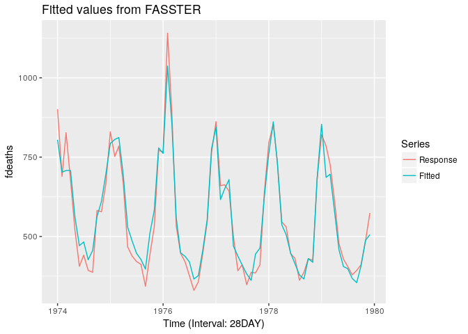
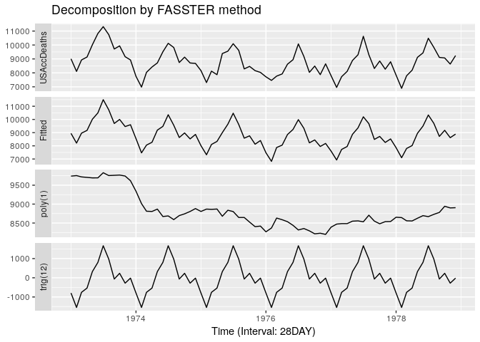
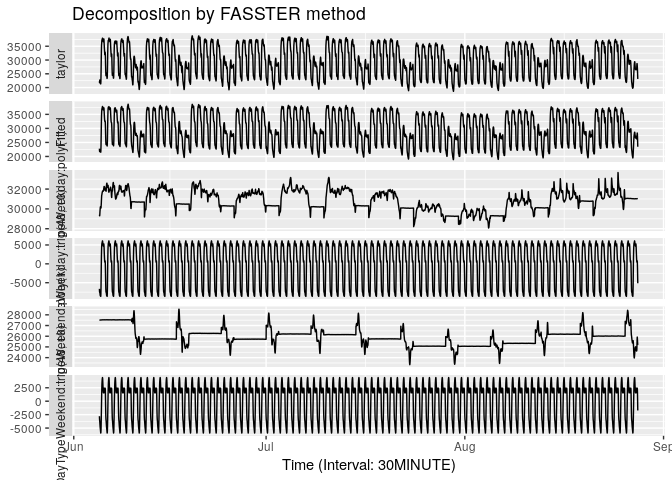

<!-- README.md is generated from README.Rmd. Please edit that file -->
fasster 
=======================================================

[](https://travis-ci.org/mitchelloharawild/fasster) <!-- [](https://cran.r-project.org/package=fasster) --> <!-- [](https://cran.r-project.org/package=fasster) -->

An implementation of the FASSTER (Forecasting with Additive Switching of Seasonality, Trend and Exogenous Regressors) model in R. This model is designed to capture patterns of multiple seasonality in a state space framework by using state switching. The *fasster* package prioritizes flexibility, computational speed and accuracy to provide convenient tools for modelling, predicting and understanding high frequency time-series.

Installation
------------

<!-- The **stable** version can be installed from CRAN: -->
<!-- ```{r, eval = FALSE} -->
<!-- install.packages("fasster") -->
<!-- ``` -->
The **development** version can be installed from GitHub using:

``` r
# install.packages("devtools")
devtools::install_github("mitchelloharawild/fasster")
```

Usage
-----

### Model specification

*fasster* allows flexible model specification by allowing the user to specify the model structure with standard formula conventions.

``` r
fasster(fdeaths ~ mdeaths) %>% ggfitted
```



Commonly used state space components can be added using the following convenience functions:

-   `poly(n)` to include an n-th order polynomial
-   `seas(s)` to include a seasonal factor of frequency s
-   `trig(s, q)` to include seasonal fourier terms of frequency s with q harmonics
-   `arma(ar, ma)` to include an ARMA term (where ar and ma are vectors of coefficients)
-   Exogenous regressors can be added by referring to their name

For example, to create a model with trend and monthly seasonality, you can use:

``` r
fit <- fasster(USAccDeaths ~ poly(1) + trig(12))
fit %>% ggfitted
```


The interface for creating a FASSTER model introduces a new formula construct, `%S%`, known as the switch operator. This allows modelling of more complex patterns such as multiple seasonality by modelling the components for each group seperately and switching between them.

``` r
fit_switch <- as_tsibble(taylor) %>%
  mutate(index = seq(ymd_h("2000-6-5 00"), by="30 mins", length.out=length(taylor)),
         DayType = ifelse(wday(index) %in% 2:6, "Weekday", "Weekend")) %>% 
  fasster(taylor ~ DayType %S% (poly(1) + trig(48, 10))) 
fit_switch %>%
  ggfitted
```


### Decomposing

Fitted FASSTER models can be decomposed to provide a description of how the underlying states function. Decomposing a FASSTER model provides aggregates of its components such as trends and seasonalities.

These components can be plotted using the autoplot function on a fitted model:

``` r
fit %>% autoplot
```



``` r
fit_switch %>% autoplot
```



The tools made available by *fasster* are designed to integrate seamlessly with the tidyverse of packages, enabling familiar data manipulation and visualisation capabilities.

### Forecasting

*fasster* conforms to the object structure from the *forecast* package, allowing common visualisation and analysis tools to be applied on FASSTER models.

``` r
library(forecast)
fit %>% accuracy
#>                     ME     RMSE      MAE        MPE     MAPE      MASE
#> Training set -23.10502 257.6256 190.2418 -0.3173936 2.204005 0.2956716
#>                   ACF1
#> Training set 0.1697722

fit %>% 
  forecast(h=24) %>%
  autoplot
```


Like other forecasting functions, if additional information is required (such as future state switching), it can be provided via the `newdata` argument.

``` r
fit_switch %>% 
  forecast(newdata = tibble(DateTime = seq(ymd_h("2000-8-28 00"), by="30 mins", length.out=48*7*2)) %>%
                    mutate(DayType = ifelse(wday(DateTime) %in% 2:6, "Weekday", "Weekend"))) %>% 
  autoplot(include = 48*7*4)
```


